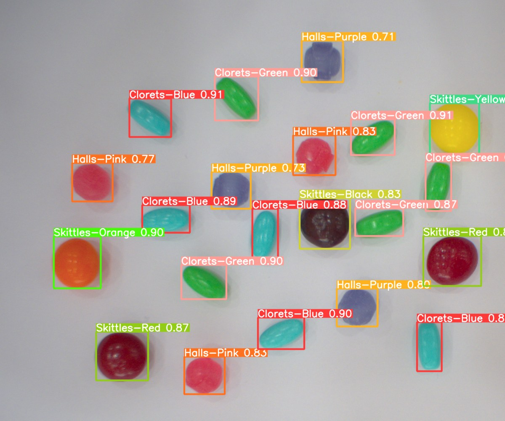
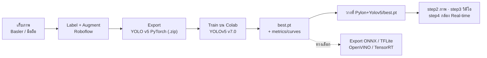
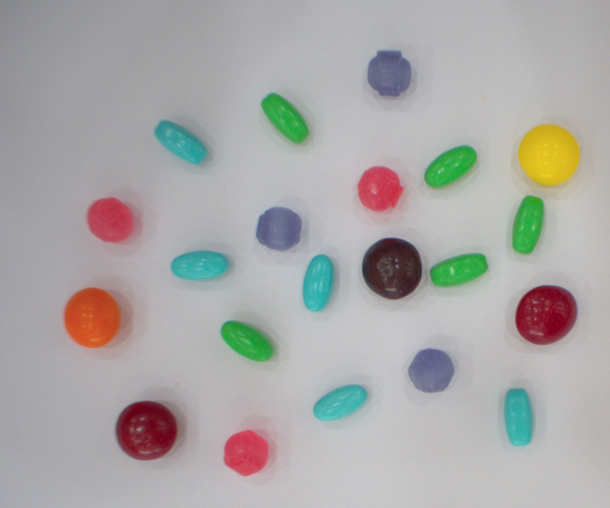
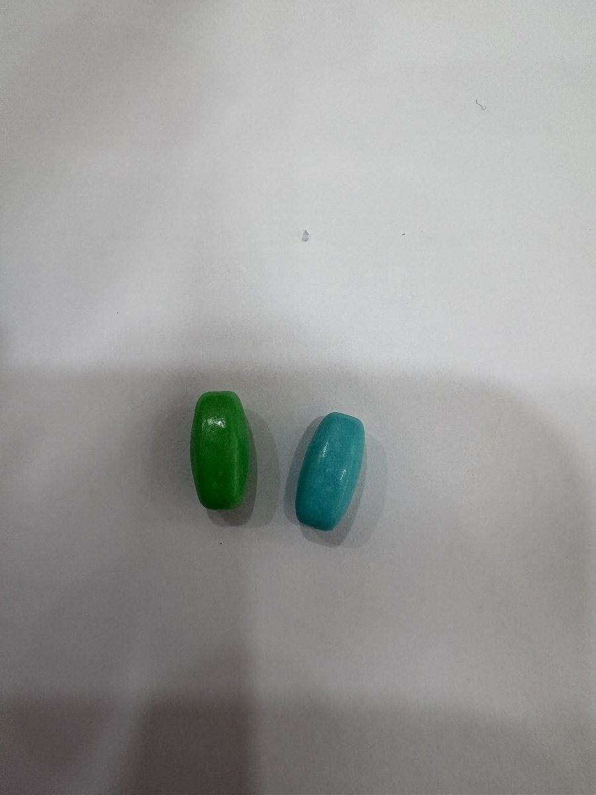
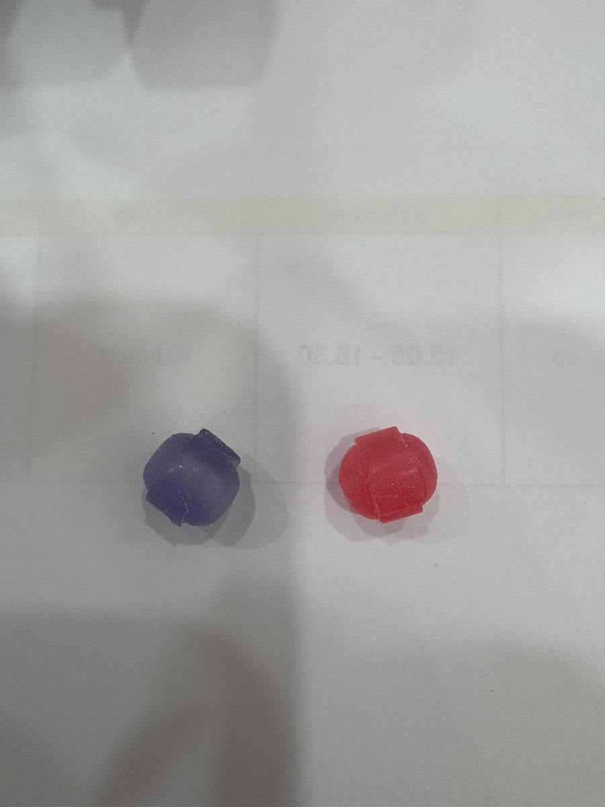
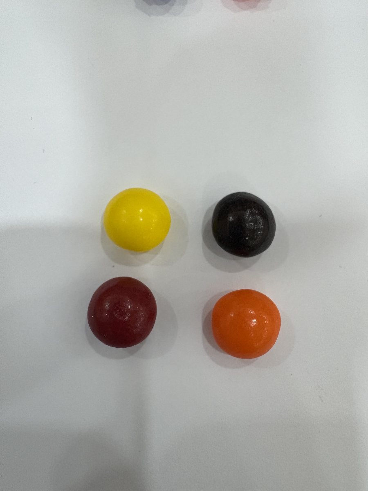
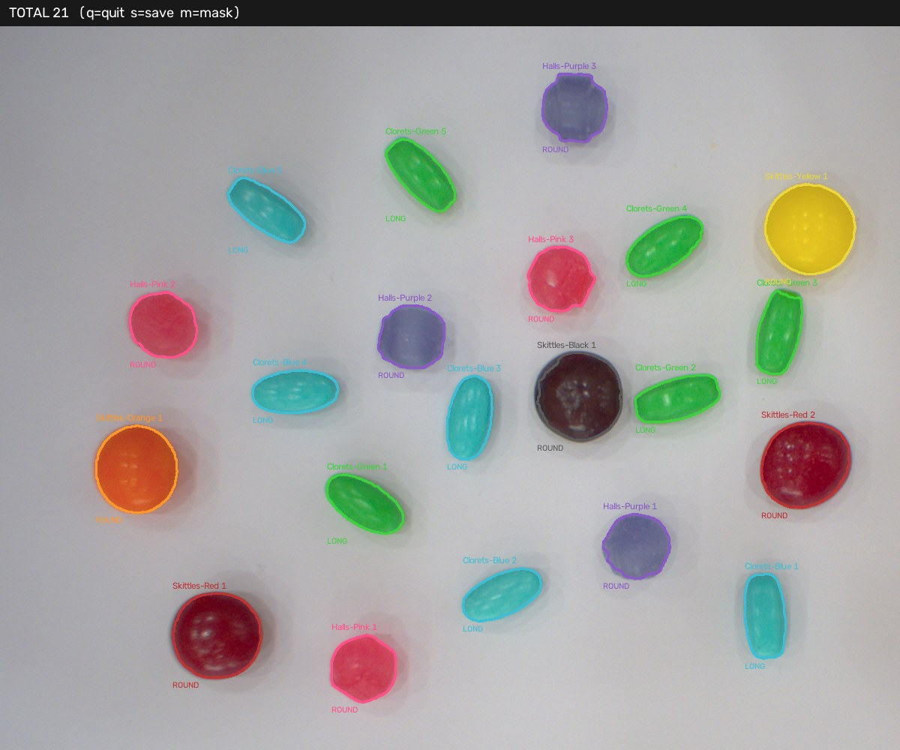

<div align="center">

# Yolov5 — Commercial & Industrial

**Object detection บนกล้องอุตสาหกรรม Basler — ตั้งแต่เก็บภาพ เทรน จนถึงรัน Real-time บนเครื่องหน้างาน**



<sub>เคสตัวอย่าง — คัดแยกลูกอม 8 ชนิด · 21 ชิ้นในเฟรมเดียว · โมเดลที่เทรนเองให้มาพร้อมใช้</sub>


-00A39B)


</div>

---

## Repo นี้คืออะไร

โครงงานตัวอย่างที่ **รันได้จริงตั้งแต่ต้นจนจบ** สำหรับงาน vision inspection ในสายการผลิต
ประกอบด้วยสามส่วนที่แยกใช้เป็นอิสระจากกันได้

| ส่วน | ใช้ทำอะไร | โฟลเดอร์ |
|---|---|---|
| **Training pipeline** | โน้ตบุ๊ก Colab ที่ patch YOLOv5 **v7.0** ให้เทรนผ่านบนไลบรารีปี 2026 ได้ | `Colab-Training/` |
| **Inference / Deployment** | โค้ดรันโมเดลบนภาพนิ่ง วิดีโอ และกล้อง Basler แบบ Real-time | `Integration-Camera-Local/Pylon+Yolov5/` |
| **Classical CV baseline** | วิธี HSV threshold ไว้เทียบว่างานนี้ "จำเป็นต้องใช้ AI ไหม" | `Integration-Camera-Local/Pylon+Opencv/` |

ทั้งชุดออกแบบให้ **ถอดเคสลูกอมออกแล้วใส่ชิ้นงานของคุณแทนได้** โดยแก้แค่ dataset + `config.py`
โค้ด inference ไม่ต้องแตะเลย → ดู [ต่อยอดกับชิ้นงานของคุณเอง](#extend)

> **ทำไมต้อง v7.0** — เป็นรีลีสสุดท้ายของ YOLOv5 ที่เป็น **GPL-3.0** ก่อนเปลี่ยนเป็น AGPL-3.0
> เมื่อ 14 เม.ย. 2023 ซึ่งเป็นเงื่อนไขที่โครงงานเชิงพาณิชย์ส่วนใหญ่รับได้มากกว่า
> รายละเอียดที่หัวข้อ [ใบอนุญาต](#license)

---

## ภาพรวม Pipeline



---

## 1 · ติดตั้ง

ต้องมี **Python 3.10 หรือ 3.11** (3.9 ใช้ได้แต่ไม่แนะนำ · 3.12+ pypylon อาจยังไม่มี wheel)
ถ้าจะต่อกล้องจริงต้องลง **Basler pylon Runtime** จาก [เว็บ Basler](https://www.baslerweb.com/en/downloads/software/) ก่อน

```bash
git clone https://github.com/bluebox-dev/Yolov5-Commercial-Industrial.git
cd Yolov5-Commercial-Industrial
python3 setup.py
```

`setup.py` สร้าง `.venv` → ติดตั้งทั้งชุดกล้องและชุด YOLOv5 → verify ทีละตัว
ครั้งแรกใช้เวลา 5–20 นาที (PyTorch ไฟล์ใหญ่) · รันซ้ำได้ไม่เสียหาย (idempotent)

| คำสั่ง | ผล |
|---|---|
| `python3 setup.py` | ติดตั้งครบทุกอย่าง |
| `python3 setup.py --core` | เฉพาะชุดกล้อง + OpenCV ข้าม PyTorch (เน็ตช้า) |
| `python3 setup.py --check` | verify อย่างเดียว ไม่ติดตั้งอะไรใหม่ |

ผ่านแล้วจะได้แบบนี้ — บรรทัดสุดท้ายต้องขึ้น `พร้อมใช้งานแล้ว`

```text
  [ ผ่าน ] numpy            2.0.2
  [ ผ่าน ] opencv-python    5.0.0
  [ ผ่าน ] pypylon          ok
  [ ผ่าน ] torch            2.8.0
  [ ผ่าน ] torchvision      0.23.0
  [ ผ่าน ] กล้อง            acA2440-20gc
```

<details>
<summary>ติดตั้งเองโดยไม่ใช้ <code>setup.py</code></summary>

```bash
python3 -m venv .venv
source .venv/bin/activate          # Windows: .venv\Scripts\activate
pip install -r requirements.txt        # pypylon + opencv + numpy
pip install -r requirements-yolo.txt   # torch + dependency ของ YOLOv5 v7.0
```

มี GPU NVIDIA และต้องการ CUDA build ให้ติดตั้ง torch ตามคำสั่งจาก [pytorch.org](https://pytorch.org) แทนบรรทัดที่สอง

</details>

> **VS Code** — เปิดที่โฟลเดอร์นอกสุด (โฟลเดอร์ที่มี `setup.py`) แล้วเลือก interpreter เป็น `.venv`
> สคริปต์ resolve path จากตำแหน่งไฟล์ตัวเอง (`yolo_lib.here()`) จึงรันจาก working directory ไหนก็ได้

---

## 2 · รันด้วยโมเดลที่ให้มา

`best.pt` (40 MB) อยู่ในโฟลเดอร์แล้ว — ไม่ต้องเทรนก่อนก็ทดสอบได้ทันที

```bash
cd Integration-Camera-Local/Pylon+Yolov5
python step1_model.py     # โหลดโมเดล + benchmark เครื่องนี้      ← รันก่อนเสมอ
python step2_image.py     # ตรวจภาพนิ่ง  (config.IMAGE_SOURCE)
python step3_video.py     # ตรวจวิดีโอ   (config.VIDEO_SOURCE)
python step4_camera.py    # กล้อง Basler Real-time                ← ต้องมีกล้อง
```

**`step1` ครั้งแรกต้องต่อเน็ต** เพื่อดึงโค้ด YOLOv5 v7.0 ผ่าน `torch.hub` มา cache ไว้
ครั้งต่อไปรัน offline ได้ · เครื่องที่ไม่มีเน็ตเลย ดูวิธี clone มาวางเองที่ [ปัญหาที่พบบ่อย](#faq)

**ปุ่มในหน้าต่างภาพ** — `q` ออก · `s` เซฟผลลัพธ์ · `p` พิมพ์ตารางสรุป · `space` หยุด/เล่นต่อ (เฉพาะวิดีโอ)

### output ที่ควรได้จาก `step2_image.py`

<table>
<tr>
<td width="50%" align="center"><br><sub>input — <code>Candy.png</code> 1536×1280</sub></td>
<td width="50%" align="center"><br><sub>output — <code>result.jpg</code> เมื่อกด <code>s</code></sub></td>
</tr>
</table>

```text
  ชนิด                 จำนวน   conf ต่ำสุด  conf เฉลี่ย
  ----------------------------------------------------
  Clorets-Blue           5       0.85        0.89
  Clorets-Green          5       0.87        0.90
  Halls-Pink             3       0.77        0.81
  Halls-Purple           3       0.71        0.74
  Skittles-Black         1       0.82        0.82
  Skittles-Orange        1       0.90        0.90
  Skittles-Red           2       0.87        0.88
  Skittles-Yellow        1       0.86        0.86
  ----------------------------------------------------
  รวมทั้งหมด 21 เม็ด
```

ตัวเลขนี้ deterministic — รันกี่ครั้งบนเครื่องไหนก็ได้เท่ากัน ใช้เป็น smoke test ได้ว่าติดตั้งถูก
`Halls-Purple` conf ต่ำสุดเพราะสีซีดและมีตัวอย่างใน dataset น้อย — เป็นคลาสแรกที่ควรเก็บภาพเพิ่ม

---

<a id="modelcard"></a>

## 3 · Model card — `best.pt` ที่ให้มา

อ่านจาก checkpoint โดยตรง ไม่ใช่ค่าที่จดไว้

| หัวข้อ | ค่า |
|---|---|
| Base weights | `yolov5m.pt` (YOLOv5 v7.0) |
| Epochs / batch / imgsz | 500 · 16 · 640 |
| Optimizer | SGD `lr0=0.01` `momentum=0.937` `weight_decay=0.0005` |
| Augmentation ที่เปิด | mosaic 1.0 · fliplr 0.5 · scale 0.5 · hsv (h .015 / s .7 / v .4) |
| Dataset | 20 ภาพ → train 14 · valid 4 · test 2 · 1536×1280 |
| ขนาดไฟล์ | 40 MB (FP32 พร้อม EMA + optimizer state) |
| เทรนเมื่อ | 2026-08-28 |

**class index ต้องตรงลำดับนี้เสมอ** — โค้ด downstream ที่อ้าง `cls` เป็นตัวเลขจะพังทันทีถ้า retrain แล้วลำดับเปลี่ยน

| idx | 0 | 1 | 2 | 3 | 4 | 5 | 6 | 7 |
|---|---|---|---|---|---|---|---|---|
| **name** | Clorets-Blue | Clorets-Green | Halls-Pink | Halls-Purple | Skittles-Black | Skittles-Orange | Skittles-Red | Skittles-Yellow |

<div align="center">
<table>
<tr>
<td align="center"><br><sub><b>Clorets</b> · ทรงยาว 2 สี</sub></td>
<td align="center"><br><sub><b>Halls XS</b> · ทรงกลมเล็ก 2 สี</sub></td>
<td align="center"><br><sub><b>Skittles</b> · ทรงกลมใหญ่ 4 สี</sub></td>
</tr>
</table>
</div>

> **ข้อจำกัดที่ต้องรู้ก่อนเอาไปใช้** — dataset มีแค่ 20 ภาพ จากมุมกล้องและสภาพแสงชุดเดียว
> ย้ายไปหน้างานที่แสงต่างออกไป ความแม่นจะตกทันที ทางแก้คือ **เก็บภาพหน้างานจริงเพิ่มแล้วเทรนใหม่**
> ไม่ใช่การไล่ลด `CONF`

---

## 4 · เทรนโมเดลของคุณเอง

### 4.1 เตรียม dataset

เก็บภาพจาก **หน้างานจริง มุมและไฟเดียวกับตอนใช้งาน** — ตัวแปรนี้สำคัญกว่าจำนวนภาพ
ในโปรเจกต์มีตัวอย่างให้ดูเป็นแนวที่ `Dataset/Image_Origin/` (20 ภาพ) และ `Dataset/Video_Origin/` (คลิปทดสอบ)

| ต้องการ | จำนวนที่แนะนำ |
|---|---|
| Proof of concept | 20–50 ภาพ/คลาส |
| ใช้งานจริงในไลน์ผลิต | 200+ ภาพ/คลาส ครอบคลุมทุกกะ ทุกสภาพแสง ทุกทิศทางการวาง |

### 4.2 Label แล้ว export

ใช้ [Roboflow](https://roboflow.com) (หรือ CVAT / LabelImg ก็ได้) → export เป็นฟอร์แมต **YOLO v5 PyTorch**
จะได้ `.zip` ที่มีโครงนี้ ซึ่งคือสิ่งที่ `train.py` ต้องการพอดี

```text
data.yaml            ← nc + names + path ของแต่ละ split
train/images  train/labels
valid/images  valid/labels
test/images   test/labels
```

ไฟล์ label เป็น `.txt` หนึ่งบรรทัดต่อหนึ่งวัตถุ พิกัด normalize 0–1 → `class_id  cx  cy  w  h`

ตัวอย่างที่ export เสร็จแล้วอยู่ที่ `Dataset/Roboflow/Candy-factory.v1i.yolov5pytorch.zip`
ต้นทางสาธารณะ: [Roboflow Universe — typecandy](https://universe.roboflow.com/kmitl-kmitl/typecandy/dataset/1) (CC BY 4.0)

### 4.3 เทรนบน Colab

เปิด `Colab-Training/YoloV5-Training.ipynb` → เปลี่ยน Runtime เป็น **GPU** → รันทีละเซลล์

เซลล์ Setup ทำงานที่จำเป็นให้ครบแล้ว ไม่ต้องแก้อะไร

- clone YOLOv5 ที่ tag `v7.0` แบบ `--depth 1`
- ตั้ง `TORCH_FORCE_NO_WEIGHTS_ONLY_LOAD=1` (torch ≥ 2.6 เปลี่ยน default ของ `torch.load`)
- comment บรรทัด `torch` ใน `requirements.txt` กัน pip ลดเวอร์ชัน torch ที่มากับ Colab จน GPU ใช้ไม่ได้
- patch 3 จุดที่โค้ดปี 2022 เข้ากับไลบรารีปัจจุบันไม่ได้ — `np.trapz` (NumPy 2.x ถอดออก ทำให้ **mAP พังตอนจบการเทรน**), `np.float`, และ `ImageFont.getsize()` ของ Pillow ≥ 10
- ดึง `yolov5s.pt` / `yolov5n.pt` จาก release v7.0 โดยตรง กัน fallback ไปหยิบ weights ที่เป็น AGPL

คำสั่งเทรนอยู่ในเซลล์ที่ 3

```bash
python train.py --img 640 --batch 16 --epochs 200 --data /content/data.yaml --weights yolov5s.pt --cache
```

| argument | เลือกยังไง |
|---|---|
| `--weights` | `yolov5n` เล็กสุด/เร็วสุด → `s` → `m` → `l` → `x` แม่นขึ้นแต่ช้าลง<br/>**`best.pt` ที่ให้มาในโปรเจกต์ใช้ `yolov5m.pt` และ 500 epochs** ซึ่งต่างจากค่า default ในโน้ตบุ๊ก |
| `--img` | ต้องเท่ากับ `IMGSZ` ตอน deploy — ไม่ตรงกัน ความแม่นตกโดยไม่มี error |
| `--batch` | ลดลงถ้าเจอ CUDA out of memory · `--batch -1` ให้ auto |
| `--epochs` | dataset เล็กใช้เยอะได้ (200–500) เพราะ YOLOv5 มี early-stopping patience 100 ในตัว |
| `--cache` | โหลดภาพเข้า RAM เร็วขึ้นชัดเจน ตัดออกถ้า RAM ไม่พอ |

### 4.4 output ที่ได้จากการเทรน

ทุกอย่างออกที่ `runs/train/exp/` — **สองไฟล์แรกคือที่ต้องเอากลับมา ที่เหลือคือหลักฐานว่าโมเดลใช้ได้จริง**

| ไฟล์ | อ่านยังไง |
|---|---|
| `weights/best.pt` | ⭐ checkpoint ที่ fitness ดีที่สุด — **ตัวนี้เอาไป deploy** |
| `weights/last.pt` | epoch สุดท้าย ใช้ resume การเทรนต่อ |
| `results.csv` · `results.png` | กราฟ loss / P / R / mAP ต่อ epoch — **val loss เริ่มขึ้นสวนทาง train loss = overfit** |
| `confusion_matrix.png` | คู่คลาสที่โมเดลสับสน — ช่องนอกแนวทแยงบอกตรง ๆ ว่าต้องเก็บภาพคลาสไหนเพิ่ม |
| `PR_curve.png` · `F1_curve.png` | จุดสูงสุดของ F1 curve คือค่า `CONF` ที่ควรตั้งตอน deploy |
| `labels.jpg` | การกระจายตัวของ label — เห็น class imbalance ได้ทันที |
| `val_batch0_pred.jpg` | ผลทำนายบนชุด validation เทียบกับ `val_batch0_labels.jpg` |
| `hyp.yaml` · `opt.yaml` | ค่าที่ใช้เทรนรอบนั้นทั้งหมด เก็บไว้ทำซ้ำ |

ตัวเลขที่ควรดูก่อนตัดสินว่า "ใช้ได้"

- **mAP@0.5** — ภาพรวมความแม่น งานคัดแยกทั่วไปควรได้ > 0.90
- **mAP@0.5:0.95** — ความแม่นของตำแหน่งกรอบ สำคัญเมื่อต้องวัดขนาดหรือหาจุดหยิบของหุ่นยนต์
- **Recall ต่อคลาส** — คลาสที่ต่ำผิดปกติคือคลาสที่ต้องเก็บภาพเพิ่ม

### 4.5 นำโมเดลมา deploy

```bash
# ดาวน์โหลด runs/train/exp/weights/best.pt จาก Colab แล้ววางทับ
cp ~/Downloads/best.pt Integration-Camera-Local/Pylon+Yolov5/best.pt
python Integration-Camera-Local/Pylon+Yolov5/step1_model.py   # ต้องขึ้นชื่อคลาสครบตามที่เทรน
```

`step1_model.py` จะพิมพ์รายชื่อคลาสที่โมเดลรู้จักออกมา — **ตรวจว่าชื่อและลำดับตรงกับ `data.yaml`**
แล้วอัปเดต `config.BOX` ให้มีสีกรอบครบทุกคลาสใหม่ (คลาสที่ไม่มีในตารางจะถูกวาดด้วยสีเขียว)

### 4.6 Export ฟอร์แมตอื่น (ทางเลือก)

เซลล์สุดท้ายของโน้ตบุ๊ก export ได้หลายฟอร์แมต — โค้ด inference ในโปรเจกต์นี้ใช้ `.pt` ผ่าน `torch.hub`
ถ้าจะไปฟอร์แมตอื่นต้องเขียน loader เอง

| เป้าหมาย | `--include` | ผลที่ได้ |
|---|---|---|
| CPU-only edge box | `onnx` / `openvino` | เร็วขึ้นได้ถึง ~3× |
| NVIDIA Jetson / dGPU | `engine` (TensorRT) | เร็วขึ้นได้ถึง ~5× |
| อุปกรณ์เล็ก / MCU-class | `tflite --int8` | ไฟล์เล็กลงราว 4× |

---

## 5 · Configuration reference

แก้ที่ `Integration-Camera-Local/Pylon+Yolov5/config.py` **ไฟล์เดียว** ทุก step อ่านจากที่นี่

| พารามิเตอร์ | ค่าเริ่มต้น | ความหมายและผลเมื่อปรับ |
|---|---|---|
| `MODEL_PATH` | `"best.pt"` | path ของ weights นับจากโฟลเดอร์ `Pylon+Yolov5` |
| `CONF` | `0.40` | ต่ำ → เจอเยอะขึ้นแต่ false positive มากขึ้น · สูง → พลาดของจริงมากขึ้น |
| `IOU` | `0.45` | เกณฑ์ NMS ลดลงเมื่อชิ้นงานวางชิดกันจนกรอบถูกยุบรวม |
| `IMGSZ` | `640` | **ต้องเท่ากับ `--img` ตอนเทรน** — ดูผลกระทบที่หัวข้อ Performance |
| `DEVICE` | `"auto"` | `auto` เลือก cuda → mps → cpu ให้เอง · บังคับได้ด้วย `"cuda"` `"mps"` `"cpu"` |
| `IMAGE_SOURCE` | `"../Candy.png"` | input ของ `step2_image.py` |
| `VIDEO_SOURCE` | `"../../Dataset/Video_Origin/1.mp4"` | input ของ `step3_video.py` |
| `WORK_WIDTH` | `1200` | ย่อภาพก่อนเข้า pipeline ให้ทุก input ขนาดเท่ากัน |
| `LOOP_VIDEO` | `True` | เล่นวิดีโอวนซ้ำ |
| `FRAME_STRIDE` | `1` | ประมวลผลทุก N เฟรม — เพิ่มค่าให้ลื่นขึ้น **โดยไม่กระทบความแม่นของเฟรมที่ตรวจ** |
| `SAVE_VIDEO` | `False` | เขียนผลลัพธ์เป็น `result.mp4` |
| `PFS_FILE` | `"Base-Conf.pfs"` | ไฟล์ค่ากล้องที่ export จาก pylon Viewer — มีไฟล์นี้จะ override สองบรรทัดล่าง |
| `EXPOSURE_US` | `8000.0` | เวลารับแสง (µs) |
| `GAIN_DB` | `0.0` | เพิ่มเป็นทางเลือกสุดท้าย — เพิ่มไฟจริงก่อนเสมอ เพราะ gain เพิ่ม noise |
| `BOX` | dict 8 คลาส | สีกรอบ (B, G, R) ต่อคลาส |

> `open_camera()` ปิด `ExposureAuto` / `GainAuto` ให้เสมอ — **auto exposure ทำให้ผลตรวจแกว่งทั้งที่ชิ้นงานไม่ขยับ**
> ค่าแสงต้องนิ่งเป็นเงื่อนไขแรกของงาน vision ในไลน์ผลิต

---

## 6 · โครงสร้างโปรเจกต์

```text
Yolov5-Commercial-Industrial/
├── LICENSE                           GPL-3.0 ฉบับเต็ม
├── THIRD-PARTY-NOTICES.md            ใบอนุญาตของ dependency ทุกตัว + เช็คลิสต์ก่อนแจกจ่าย
├── setup.py                          ติดตั้ง + verify ทั้งหมดในไฟล์เดียว
├── requirements.txt                  pypylon · opencv-python · numpy
├── requirements-yolo.txt             torch · torchvision · dependency ของ YOLOv5 v7.0
│
├── Integration-Camera-Local/
│   ├── Candy.png                     ภาพทดสอบมาตรฐาน 1536×1280 (21 ชิ้น)
│   │
│   ├── Pylon+Yolov5/                 ── ส่วน deployment ที่เอาไปใช้ต่อ ──
│   │   ├── config.py                 ⭐ พารามิเตอร์ทั้งหมด
│   │   ├── yolo_lib.py               ⭐ ตรรกะจริงทั้งหมด — import ไปใช้ในโปรแกรมคุณได้เลย
│   │   ├── best.pt                   weights 8 คลาส (yolov5m · 500 epochs)
│   │   ├── step1_model.py            โหลดโมเดล + benchmark
│   │   ├── step2_image.py            ภาพนิ่ง
│   │   ├── step3_video.py            วิดีโอ + วัด FPS
│   │   ├── step4_camera.py           Basler Real-time + แยกเวลา grab/infer
│   │   └── Base-Conf.pfs             ค่ากล้องจาก pylon Viewer
│   │
│   └── Pylon+Opencv/                 ── baseline แบบไม่ใช้ AI ──
│       ├── config.py                 ตาราง HSV · MIN_AREA · LONG_RATIO
│       ├── candy_lib.py              ตรรกะร่วม
│       ├── step1_grab.py … step6_camera.py
│       └── Base-Conf.pfs
│
├── Colab-Training/YoloV5-Training.ipynb    เทรน · ทดสอบ · export
├── Dataset/
│   ├── Image_Origin/                 ภาพต้นฉบับ 20 ใบ
│   ├── Roboflow/                     dataset ที่ export แล้ว (YOLO v5 PyTorch)
│   ├── Video_Origin/                 คลิปทดสอบ 1–3.mp4 · homework.mp4
│   └── Result Model/                 ตัวอย่าง output
└── docs/                             ภาพประกอบเอกสาร
```

**สถาปัตยกรรมเดียวกันทั้งสองโฟลเดอร์** — `config.py` เก็บค่าปรับได้ทั้งหมด · `*_lib.py` เก็บตรรกะที่ใช้ซ้ำ
· `stepN_*.py` เป็น entry point บาง ๆ ที่แค่เรียก lib ตามลำดับ
ผลคือ **`stepN_*.py` ทิ้งได้ทั้งหมด** เมื่อจะเขียนแอปของตัวเอง เหลือแค่ `yolo_lib.py` + `config.py`

---

<a id="extend"></a>

## 7 · ต่อยอดกับชิ้นงานของคุณเอง

### เปลี่ยนเคสงาน — เช็คลิสต์

1. เก็บภาพชิ้นงานจากหน้างานจริง → label → export YOLO v5 PyTorch
2. เทรนด้วยโน้ตบุ๊กเดิม (แก้แค่ `data.yaml` ที่อัปโหลด)
3. วาง `best.pt` ทับไฟล์เดิม
4. แก้ `config.BOX` ให้ครบทุกคลาสใหม่
5. ปรับ `CONF` ตามจุดสูงสุดของ `F1_curve.png` ที่ได้จากการเทรน
6. รัน `step1_model.py` ยืนยันชื่อคลาส แล้ว `step2_image.py` ยืนยันผลบนภาพจริง

**ไม่ต้องแก้** `yolo_lib.py` และ `stepN_*.py` เลย — ไม่มี logic ที่ผูกกับลูกอมอยู่ในนั้น

### ใช้ `yolo_lib` เป็นไลบรารีในโปรแกรมของคุณ

```python
import sys
sys.path.insert(0, "Integration-Camera-Local/Pylon+Yolov5")   # ต้องมีทั้ง yolo_lib และ config

import cv2
import yolo_lib as Y

model = Y.load_model(quiet=True)          # อ่าน MODEL_PATH / CONF / IOU / DEVICE จาก config
frame = Y.resize_work(cv2.imread("myshot.png"))
Y.warmup(model, frame)                    # warm-up ด้วยขนาดเฟรมจริง ก่อนเริ่มจับเวลา

found = Y.detect(model, frame)
# [{'name': 'Halls-Pink', 'conf': 0.81, 'box': [x1, y1, x2, y2]}, ...]

for it in found:
    if it["conf"] < 0.6:
        reject(it)                        # ตรรกะ PLC / robot / ฐานข้อมูล ของคุณ
```

| ฟังก์ชันที่ใช้บ่อย | ทำอะไร |
|---|---|
| `load_model(quiet=False)` | โหลด v7.0 ผ่าน `torch.hub` ปัก tag · ตั้ง conf/iou · ย้ายไป device ที่เร็วที่สุด · fallback เป็น cpu เองถ้าย้ายไม่สำเร็จ |
| `detect(model, bgr)` | รับภาพ **BGR** → คืน list ของ dict `{name, conf, box}` |
| `resize_work(img)` | ย่อให้กว้าง `WORK_WIDTH` เท่ากันทุก input |
| `warmup(model, sample)` | รันเปล่า 2 รอบด้วย **ขนาดเดียวกับภาพจริง** ก่อนวัดเวลา |
| `annotate(bgr, found)` | วาดกรอบ + label + banner สรุป |
| `print_table(found)` | สรุปจำนวน/conf ต่อคลาสลง stdout |
| `Meter()` | EMA ของ FPS และเวลาแยกรายท่อน (`part("grab", …)`) |
| `open_camera()` | เปิดกล้องตัวแรก · โหลด `.pfs` · ปิด auto exposure/gain · คืน `(camera, converter)` |
| `here(path)` | แปลง relative path ให้อิงโฟลเดอร์ของสคริปต์ ไม่ใช่ cwd |

<details>
<summary><b>สองบรรทัดที่ห้ามย้าย</b> — สาเหตุที่ <code>yolo_lib.py</code> ตั้ง env var ก่อน <code>import torch</code></summary>

```python
os.environ["TORCH_FORCE_NO_WEIGHTS_ONLY_LOAD"] = "1"   # torch ≥ 2.6 ไม่งั้นโหลด .pt ไม่ได้
os.environ["YOLOv5_AUTOINSTALL"] = "false"             # กัน YOLOv5 สั่ง pip install เองบนเครื่องหน้างาน
```

PyTorch อ่าน env var ตอน import — ย้ายลงไปหลัง `import torch` เมื่อไหร่ จะ error เรื่อง `weights_only` ทันที
ถ้าเขียนโมดูลใหม่ที่ import `yolo_lib` ให้ import มันก่อน torch เสมอ

</details>

---

## 8 · Performance ที่วัดได้จริง

วัดบน MacBook ชิป M-series · เฟรมที่ 400 ของ `1.mp4` (มีชิ้นงานครบ 21 ชิ้น) · median จาก 8 รอบหลัง warm-up

| DEVICE | IMGSZ | เวลา/เฟรม | FPS | ผลนับ |
|---|--:|--:|--:|:--:|
| `cpu` | 640 | 103 ms | 9.7 | 21 ✅ |
| `cpu` | 416 | 49 ms | 20.4 | 21 ✅ |
| `cpu` | 320 | 34 ms | 29.2 | **22** ❌ |
| **`mps`** | **640** | **38 ms** | **26.4** | **21** ✅ |
| `mps` | 416 | 21 ms | 48.5 | 21 ✅ |
| `mps` | 320 | ~19 ms | ~52 | **22** ❌ |

เวลาเกือบทั้งหมดหมดไปกับตัวโมเดล — **95% บน mps และ 98% บน cpu**
ส่วนอ่านเฟรม + resize + วาดกรอบ รวมกันแค่ ~2 ms จึงไม่ใช่จุดที่ควรไปเร่ง

> **ลด `IMGSZ` แล้วผลนับเปลี่ยนจริง** และเปลี่ยนไม่เหมือนกันในแต่ละภาพ — เฟรมข้างบนเพี้ยนที่ 320
> ส่วน `Candy.png` เพี้ยนตั้งแต่ 416 โมเดลเทรนมาที่ 640 **ลดแล้วต้อง validate ใหม่ทุกครั้ง อย่าดูแค่ FPS**
>
> ต้องการความลื่นโดยไม่แลกความแม่น ให้ใช้ `FRAME_STRIDE = 2` แทนการลด `IMGSZ`

สังเกตว่า `mps` ที่ 320 ไม่ได้เร็วกว่า 416 อย่างมีนัยสำคัญ เพราะที่ขนาดนั้นเวลาส่วนใหญ่หมดไปกับ
overhead ของการส่งงานเข้า GPU ไม่ใช่การคำนวณ

### ประเมินเครื่องปลายทาง

| เครื่อง | device ที่ได้ | ความเร็วโดยประมาณ |
|---|---|---|
| Mac ชิป M-series | `mps` | ~26 FPS |
| Windows/Linux + NVIDIA | `cuda` | เร็วที่สุด |
| ไม่มี GPU | `cpu` | ~10 FPS |

รัน `step1_model.py` เพื่อวัดตัวเลขจริงของเครื่องปลายทางก่อนตัดสินใจ spec

---

## 9 · Baseline แบบไม่ใช้ AI (OpenCV HSV)

`Integration-Camera-Local/Pylon+Opencv/` ทำโจทย์เดียวกันด้วย HSV threshold + contour
มีไว้เพื่อตอบคำถามที่ควรถามก่อนเสมอ — **งานนี้จำเป็นต้องใช้ AI จริงไหม**

<table>
<tr>
<td width="50%" align="center"><br><sub>input เดียวกัน</sub></td>
<td width="50%" align="center"><br><sub>output จาก HSV — ได้ 21 ชิ้นเท่ากัน</sub></td>
</tr>
</table>

| | HSV threshold | YOLOv5 |
|---|---|---|
| เตรียมงาน | ไม่ต้อง label | label + เทรน |
| จูน | 6 ตัวเลขต่อคลาส (`h/s/v` × min/max) | เทรนครั้งเดียว |
| เปลี่ยนสภาพแสง | ต้องจูนใหม่ทุกครั้ง | ทนกว่า ถ้า dataset หลากหลาย |
| ชิ้นงานทับซ้อน | นับรวมเป็นชิ้นเดียว | แยกออกได้ |
| ความเร็ว | เร็วมาก (ระดับ ms) | ช้ากว่า ต้องการเครื่องแรงกว่า |
| อธิบายผลได้ | ได้ทุกพิกเซล | ต้องดู confusion matrix |

**ถ้างานของคุณแยกด้วยสีได้อยู่แล้ว ไม่จำเป็นต้องใช้ AI** — เลือกเครื่องมือให้พอดีกับปัญหา

จุดที่ HSV แพ้ชัดในเคสนี้: `Halls-Pink` `Skittles-Red` `Skittles-Black` มีค่า `h` เกือบเท่ากัน
ต้องแยกด้วยความสว่าง (`v`) เป็นสามช่วงที่ไม่ทับกัน ซึ่งพังทันทีที่ไฟเปลี่ยน

พารามิเตอร์หลักใน `Pylon+Opencv/config.py` — `COLORS` (ตาราง h/s/v ต่อคลาส) · `MIN_AREA` / `MAX_AREA`
(กรองเศษและพื้นหลัง) · `LONG_RATIO` (แยกทรงยาว/ทรงกลม) · `OPEN_SIZE` / `CLOSE_SIZE` (morphology)
จูนค่าใหม่ได้ด้วย `step3_extract.py` ซึ่งมี trackbar ให้ลาก แล้วกด `p` เพื่อพิมพ์บรรทัดที่เอาไปวางใน `COLORS` ได้ตรง ๆ

---

<a id="faq"></a>

## ปัญหาที่พบบ่อย

<details open>
<summary><b>ติดตั้ง / โหลดโมเดล</b></summary>

| อาการ | สาเหตุและทางแก้ |
|---|---|
| `ModuleNotFoundError` | ยังไม่ได้ activate `.venv` หรือ VS Code เลือก interpreter ผิด · แก้ไม่หายให้ลบ `.venv` แล้ว `python3 setup.py` ใหม่ |
| `ยังไม่ได้ติดตั้ง PyTorch` | มักเน็ตหลุดระหว่างโหลด — รัน `python3 setup.py` ซ้ำ |
| `No module named 'ultralytics'` | โค้ดปักที่ v7.0 แล้ว ถ้ายังเจอให้ลบ `~/.cache/torch/hub` แล้วรันใหม่ |
| `No module named 'IPython'` | dependency ของ v7.0 ขาด — รัน `setup.py` ซ้ำ |
| error เรื่อง `weights_only` | env var ถูกตั้งหลัง `import torch` — ดูหัวข้อ "สองบรรทัดที่ห้ามย้าย" |
| เครื่องไม่ต่อเน็ต | `git clone -b v7.0 https://github.com/ultralytics/yolov5` วางไว้ใน `Pylon+Yolov5/` แล้ว `yolo_lib` จะใช้ตัว local อัตโนมัติ |

</details>

<details>
<summary><b>กล้อง Basler</b></summary>

| อาการ | สาเหตุและทางแก้ |
|---|---|
| `ไม่พบกล้อง` | **pylon Viewer ยังเปิดอยู่** (กล้องเปิดได้ทีละโปรแกรม) · เสียบผ่าน USB hub · ยังไม่ได้ลง pylon Runtime |
| `device is exclusively opened` | มีโปรเซสอื่นถือกล้องอยู่ ปิดให้หมดแล้วรันใหม่ |
| `ExposureTime` error | GigE รุ่นเก่าใช้ `ExposureTimeAbs` — `set_manual()` ดักไว้ทั้งสองชื่อแล้ว |
| เฟรมตก / grab ช้าผิดปกติ | ย้ายไปพอร์ต USB3 (SS สีฟ้า) โดยตรง · ลด FPS · ตั้ง ROI ให้แคบลง · GigE ให้เปิด jumbo frame |
| ผลแกว่งทั้งที่ชิ้นงานไม่ขยับ | auto exposure/gain ยังเปิดอยู่ หรือมีแสงภายนอกรบกวน |
| `grab` สูงกว่า `infer` ใน step4 | คอขวดอยู่ที่กล้อง ไม่ใช่โมเดล — ลด exposure หรือ bandwidth ก่อน อย่าไปลด `IMGSZ` |

</details>

<details>
<summary><b>ความแม่นของโมเดล</b></summary>

| อาการ | สาเหตุและทางแก้ |
|---|---|
| ความแม่นตกเมื่อย้ายไปหน้างานจริง | domain shift — เก็บภาพหน้างานจริงเพิ่มแล้วเทรนใหม่ ไม่ใช่ลด `CONF` |
| ตรวจไม่เจอชิ้นงานเล็ก | อย่าลด `IMGSZ` ต่ำกว่าตอนเทรน · พิจารณาเทรนที่ 1280 หรือขยับกล้องเข้าใกล้ |
| กรอบซ้อนกันหลายอันบนชิ้นเดียว | ลด `IOU` ให้ NMS ตัดแรงขึ้น |
| ชิ้นที่วางชิดกันถูกยุบเป็นกรอบเดียว | เพิ่ม `IOU` · เพิ่มภาพที่ชิ้นงานวางชิดกันเข้า dataset |
| conf ต่ำเฉพาะบางคลาส | class imbalance — ดู `labels.jpg` และ `confusion_matrix.png` แล้วเก็บภาพคลาสนั้นเพิ่ม |
| ผลไม่นิ่งระหว่างรัน | `DEVICE` ต่างกันให้ผลต่างกันเล็กน้อยจาก floating point ได้ แต่จำนวนที่นับได้ควรเท่ากัน |

</details>

---

<a id="license"></a>

## ใบอนุญาตและการใช้เชิงพาณิชย์

โปรเจกต์นี้เผยแพร่ภายใต้ **GPL-3.0** — ตัวบทฉบับเต็มอยู่ที่ [`LICENSE`](LICENSE)
ใบอนุญาตของส่วนประกอบภายนอกทุกตัว และเช็คลิสต์ก่อนแจกจ่าย อยู่ที่ [`THIRD-PARTY-NOTICES.md`](THIRD-PARTY-NOTICES.md)

```
Copyright (C) 2026 bluebox-dev
Licensed under the GNU General Public License v3.0 or later.
```

| ส่วน | ใบอนุญาต |
|---|---|
| โค้ดและสื่อในโปรเจกต์นี้ | **GPL-3.0** |
| YOLOv5 **v7.0** (สถาปัตยกรรม · เทรน · inference) | **GPL-3.0** |
| `best.pt` ที่แจกมาใน repo | **GPL-3.0** (สืบทอดจาก YOLOv5 v7.0 ที่ใช้เทรน) |
| YOLOv5 ตั้งแต่ 14 เม.ย. 2023 เป็นต้นไป | AGPL-3.0 — โปรเจกต์นี้ **ไม่ได้ใช้** |
| Dataset `typecandy` | CC BY 4.0 — ต้องระบุที่มา |
| pypylon | BSD-3-Clause |
| Basler pylon Camera Software Suite | **กรรมสิทธิ์ของ Basler** — ไม่ได้แจกจ่ายมากับ repo นี้ |

**GPL-3.0 ใช้เชิงพาณิชย์ได้** แต่เป็น copyleft — ถ้า **แจกจ่าย** ซอฟต์แวร์ที่รวมโค้ดนี้ ต้องเปิดซอร์สส่วนนั้นด้วย
ใช้ภายในองค์กรโดยไม่แจกจ่ายออกไป ไม่มีข้อผูกพันนี้ · และไม่มีข้อบังคับ network-use แบบ AGPL จึงทำ API/SaaS ได้

การปักที่ tag `v7.0` ทั้งในโน้ตบุ๊ก (`git clone -b v7.0`) และใน `yolo_lib.py`
(`torch.hub.load("ultralytics/yolov5:v7.0", ...)`) จึงเป็น **ข้อกำหนดด้านใบอนุญาต ไม่ใช่แค่การล็อกเวอร์ชัน**
อัปเป็น branch ปัจจุบันเมื่อไหร่ ทั้งโปรเจกต์กลายเป็น AGPL-3.0 ทันที

> **ก่อนแจกจ่ายผลิตภัณฑ์ที่รวมโค้ดนี้กับ Basler pylon** — การเชื่อมโค้ด GPL เข้ากับไลบรารีกรรมสิทธิ์
> เป็นประเด็นที่ต้องพิจารณา ดูรายละเอียดและข้อความ §7 additional permission ที่เตรียมไว้ให้
> ใน [`THIRD-PARTY-NOTICES.md`](THIRD-PARTY-NOTICES.md#pylon-gpl)

<sub>ข้อความข้างต้นเป็นสรุปเพื่อความเข้าใจ ไม่ใช่คำแนะนำทางกฎหมาย — โครงการเชิงพาณิชย์ควรตรวจสอบกับฝ่ายกฎหมายของตนเอง</sub>

---

<div align="center">
<sub>ปิด pylon Viewer ก่อนรันสคริปต์ Python ทุกครั้ง — กล้อง Basler เปิดได้ทีละโปรแกรมเท่านั้น</sub>
</div>
